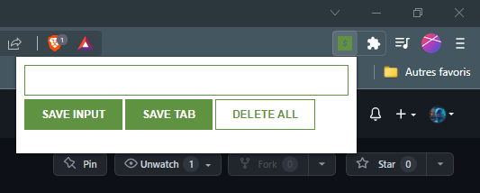
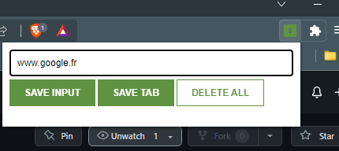
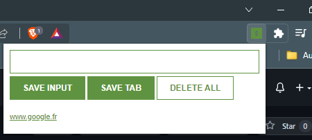
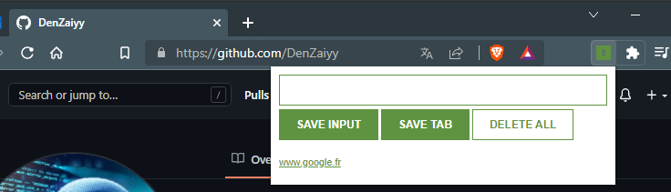
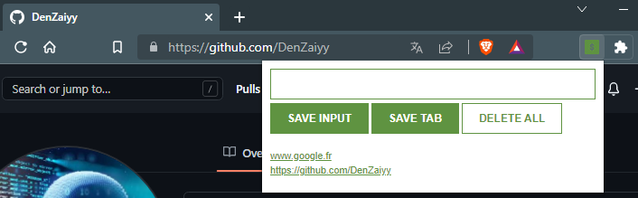
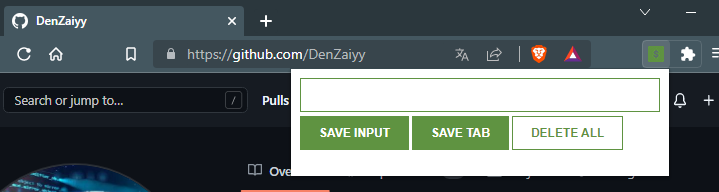

# freeCodeCamp - Chrome Extension

Vidéo (parti 3) [freeCodeCamp - JavaScript Programming (Full Course)](https://youtu.be/jS4aFq5-91M) utilisé pour réaliser cet exercice (Chrome Extension)

## Fonctionnalités

- Possibilité d'ajouter une url manuellement
- Possibilité d'ajouter l'onglet actuelle dans la liste
- Possibilité de supprimer tout les élements stocker

## Rendu

### L'ouverture de l'extension

### Saisi d'une URL à la main
- Saisi de l'url dans l'input\

- Résultat après avoir cliqué sur "SAVE INPUT"\

### Sauvegarder l'onglet ouvert
- Aller sur l'onglet que vous souhaitez sauvegarder\

- Résultat après avoir cliquer sur "SAVE TAB"\

### Supprimer toute la liste (en double cliquant sur "DELETE ALL")

